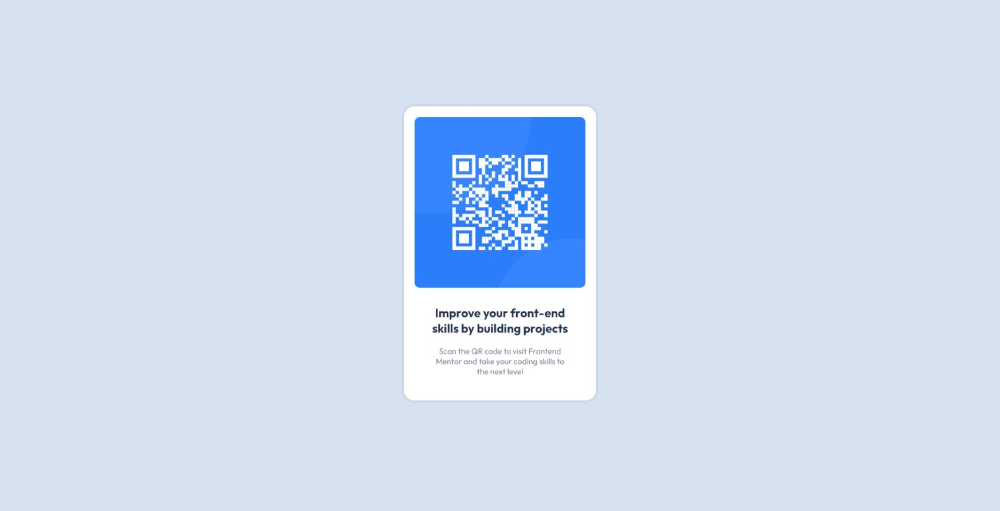

# Frontend Mentor - QR code component solution

This is a solution to the [QR code component challenge on Frontend Mentor](https://www.frontendmentor.io/challenges/qr-code-component-iux_sIO_H). Frontend Mentor challenges help you improve your coding skills by building realistic projects.

## Table of contents

- [Overview](#overview)
  - [Screenshot](#screenshot)
  - [Links](#links)
- [My process](#my-process)
  - [Built with](#built-with)
  - [What I learned](#what-i-learned)
  - [Continued development](#continued-development)
  - [Useful resources](#useful-resources)
- [Author](#author)
- [Acknowledgments](#acknowledgments)

**Note: Delete this note and update the table of contents based on what sections you keep.**

## Overview

### Screenshot

### Links

<!-- - Solution URL: [https://tchananet.github.io/qr-code-component/](https://tchananet.github.io/qr-code-component/) -->

- Live Site URL: [https://tchananet.github.io/qr-code-component/](https://tchananet.github.io/qr-code-component/)

## My process

### Built with

- Semantic HTML5 markup
- CSS custom properties
- CSS Grid

### What I learned

Learned more about CSS viewpoint sizes and layout

### Useful resources

- [W3Schools](https://www.w3schools.com/) - This helped me learn and discover some nice CSS tricks like box-shadow and grid layout

## Author

<!-- - Website - [Add your name here](https://www.your-site.com) -->

- Frontend Mentor - [@tchananet](https://www.frontendmentor.io/profile/tchananet)
<!-- - Twitter - [@yourusername](https://www.twitter.com/yourusername) -->
